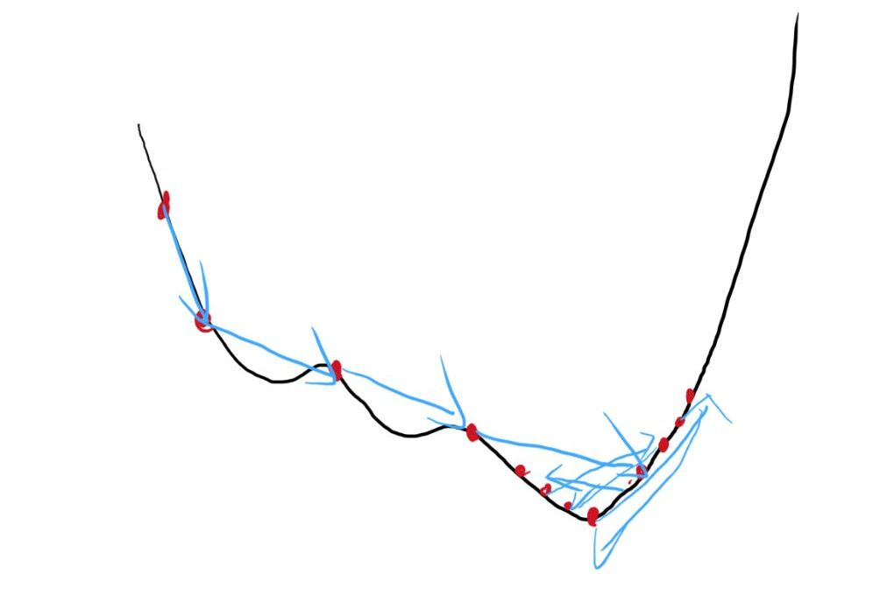

### 前言
这边引用一句话来表达我的感想："Functions Describe the World!"
### 提示与说明
为什么说是最基础的神经网络呢，因为其搭建难度非常低，原理非常通俗易懂。所以该神经网络的掌握，可能得多次区分**学习率，隐藏层节点**与训练结果的关系。
### 原理
推荐看这个视频:https://www.bilibili.com/video/BV1Vj411P7N6?vd_source=577f8f9542268a8cddf34ac91b82a10f
接下来是我的复述或者说笔记，也是看了视频后自己对这个bp神经网络的理解。

bp神经网络的原理括可以为：向前传播求出节点值，向后传播修改边的权重值。至于以什么方式修改，这边大致也聊一聊：取一个叫做：”离谱程度“的函数：$f=(目标值-实际值)^2$，至于为什么取这个函数，跟后续的求导有关。然后我们的目的就是让所有的输入值产生的实际输出值与理想输出值差距最小，即”离谱程度“最小。

实际上如果要完全理解这个原理，还得从单一节点开始，一个输入会对应一个输出，这没毛病吧？我们先暂且将之理解为线性函数（比如就是实际值-目标值），那么咱们可以迅速反应其（离谱程度）最小值，那如果线性变化后再进行了一个非线性的变化，如取一次平方，你还能迅速反应出来该函数的最小值吗？但咱们学过求导，所以直接能算出来它的最小值。好的难度升级了，先进行了线性再进行非线性变化，然后拿这个变化后的值进行线性变化并且求最小值，如何求呢？ok,好，你喜欢求导，可以，咱们继续求导。但这个变化太过于复杂，如果一个节点也许你的计算机可以直接求出其最小值所对应的y的最小值时x的取值，那如果我跟你说一个完整的神经网络可能得有成千上万的变量呢？你学过高数，直接快速抢答——偏导，我只需要把其他变量看为常数，最终求出来的导数为零时每个变量的值，就是我函数的最小值。聪明，但还差了点。

因为你得用求导并且找最值的方法计算成千上万次。（实际上上世纪的大佬已经找到了一个兼顾准确率与求导方便程度的函数了）但你还得使得导数为0并且算最值，这计算量可想而知的大（需要很多次的配平常数，还得取对数...）。

于是出现一个非常天才的算法：梯度下降：通过微调来达到最小值。

这张图就很生动，我不知道怎么走，我就朝着梯度的方向走一段，当梯度为0时就找到了最低点。由于梯度下降本身就是一个通过慢慢"走"而得到最终结果的，所以需要大量的数据，谁能指望其一次就能走到最低点呢？

最精彩的部分就在这边了，因为梯度下降中，每一步的距离我们可以自定义，你可以设置为1，0.5....但我看了很多博客和大佬的分析，最好是不要超过1。因为太大，你可能就容易错过真正的最小值，还可能让权重变得非常大，产生梯度爆炸。太小就容易陷入局部的最小值，也可能让整个权重变得很小，梯度就消失了，并且需要的数据也比较多。

学习率过大的情况，可能即使找到了最低区间，但由于学习率过大，容易错过它，不能精确定位在那，所以效果就是准确率的浮动较大。


学习率较小的情况，可能陷入局部最小（极小），而不是最小值，导致准确率最终的结果较小，就是达不到高的准确值。还有就是如果运气较好，避开了局部最优，需要的训练数据，需要的时间，算力也是多出了很多的。（人工智能领域训练数据与训练时间，算力是最宝贵的）


-------------------------------------------------------------------------------------------------------------
至于隐藏层节点数量的影响，我也没太搞懂，放一个ai生产的解答：

在BP神经网络（反向传播神经网络）中，隐藏层节点的数量和结构对模型的表现有很大影响。具体来说，隐藏层节点的数量和配置会影响以下几个方面：
- **节点过少**：如果隐藏层节点数量太少，网络可能无法捕捉到输入数据中的复杂关系，表现出欠拟合（underfitting），即模型无法有效学习训练数据的特征。
- **节点过多**：如果隐藏层节点数量过多，网络可能会过度学习训练数据中的噪声，导致过拟（overfitting）。此时，模型会在训练数据上表现很好，但在新数据上表现差。

--------------------------------------------------------------------------

所以评判一个神经网络的好坏就是学习率，隐藏层节点找的准不准确，合不合适（自我见解），反映在验证集上。

处理好这个，再处理一下反向更新隐藏层的目标节点值，因为最终层的目标值我们是知道的（训练集的标签值），那么隐藏层的目标值呢？这边给出个大致：

- 计算隐藏层的误差：$δh=∑whδ⋅σ′(zh)δh​=∑wh​δ​⋅σ′(zh​)$
- 这里，$wh​$ 是隐藏层到输出层的权重，$δ$ 是输出层的误差。

看不懂，解释一下，也可以自行看视频。$δ$ 是输出层的误差，就是把目标值-实际值得到的东西。再把这个东西按照连接到的边按权重均分，得到前一层节点的分出来的值。这是一个节点，还有后面一堆节点也会分出值，最终隐藏层就是分割出来的值相加。当然，又是与矩阵乘法一样的逻辑。
往复，就能更新很多前权重了。（如果没印象可以去看看视频）

于是就创造出来了一个可以拟合任何函数的"网络"。至于原理可以详细了解一下**近似定理**这个东西。得到了函数，得到了世界！因为所有的一切都是函数构成。
### 代码解读
要有吗？我感觉注释很清晰了，再分块解释一下吧。
```python
front_edge = np.random.randn(self.input_size, self.hidden_size) / np.sqrt(self.hidden_size / 2.0)
```
最开始的初始化很讲究，不能太小不能太大，太小直接梯度消失，太大直接梯度爆炸，这个初始化困扰了我一下午，搞了半天发现初始化问题，这一点视频没有强调，但我血的教训让我不得不将之放到第一个。至于这个代码啥意思呢，就是说把这个随机范围设置均值为0，方差为 $2/中间层神经元数量$​ 的**正态分布**。

```python
def calc_light(self, in_put):  
    # 中间节点的计算  
    nodes = np.dot(in_put.T, self.front_edge).T  
    nodes = np.vectorize(sigmoid)(nodes)  # 非线性化sigmoid(x)  
  
    # 计算最右边亮度  
    right_light = np.dot(nodes.T, self.back_edge).T  
    right_light = np.vectorize(sigmoid)(right_light)  # 非线性化sigmoid(x)  
  
    return right_light, nodes
```
反向更改权值，这是矩阵乘法优化后的代码，比之前代码效率提高将近20倍！
```python
import numpy as np  
  
def sigmoid(x):  
    return 1 / (1 + np.exp(-x))  
  
def calc_weight(left_light, right_light, ans, row, lie, edge_weight, learn_alpha):  
    """  
    计算并更新权重  
    :param left_light: 前一层节点的输出值，形状为 (row, 1)    :param right_light: 当前层节点的输出值，形状为 (lie, 1)    :param ans: 目标值，形状为 (1, lie)    :param row: 前一层节点数  
    :param lie: 当前层节点数  
    :param edge_weight: 权重矩阵，形状为 (row, lie)    :param learn_alpha: 学习率  
    :return: 更新后的权重矩阵和误差值  
    """    # 计算误差值，dif_value = y_true - y_pred  
    dif_value = (ans.T - right_light)  # 形状为 (lie, 1)  
    # 计算梯度  
    gradient = right_light * (1 - right_light) * dif_value  # 形状为 (lie, 1)  
    # 更新权重  
    edge_weight += learn_alpha * np.dot(left_light, gradient.T)  # 形状为 (row, lie)  
    return edge_weight, dif_value
```

训练网络也封装了函数，并指定一个输出文件，方便后续一次性调用
```python
def train_network(self, x_train, y_train, x_val, y_val, front_edge_file, back_edge_file, validation_file):  
    """  
    训练神经网络  
    :param validation_file: 验证结果保存路径  
    :param back_edge_file: 反向权重保存路径  
    :param front_edge_file: 前向权重保存路径  
    :param y_val: 验证集标签  
    :param x_val: 验证集数据  
    :param x_train: 训练集数据  
    :param y_train: 训练集标签  
    """    for i in range(len(x_train)):  
        if i % 1000 == 0 and i != 0:  
            right_prediction_sum = 0  
            confidence = 0  
            for j in range(len(x_val)):  
                in_put = np.array(x_val[j])  # 输入数据  
  
                right_light, nodes = self.calc_light(in_put)  
  
                predict_value = np.argmax(right_light)  
                if predict_value == y_val[j]:  
                    right_prediction_sum += 1  
                    confidence += np.max(right_light)  
            with open(validation_file, "a", encoding="utf-8") as f:  # 使用 "a" 模式追加写入  
                f.write(f"第{i}次准确率: {right_prediction_sum/len(y_val):.4f}, 置信度: {confidence/right_prediction_sum:.4f}\n")  
  
        # 随机选择一个索引  
        print(f"开始训练第{i + 1}组数据")  
  
        # 训练数据 in_put        in_put = np.array(x_train[i])  # 输入数据  
  
        # 前向传播计算节点值  
        right_light, nodes = self.calc_light(in_put)  
  
        # 定义目标亮度  
        tar_nodes = np.zeros((1, self.output_size))  # 定义目标亮度  
  
        # 给目标亮度赋值（标签集）  
        for j in range(self.output_size):  
            if j == y_train[i]:  
                tar_nodes[0][j] = 0.999  # 目标类别设置为 0.999            else:  
                tar_nodes[0][j] = 0.001  # 非目标类别设置为 0.001  
        # 反向传播更新后边权重  
        self.back_edge, dif_value = calc_weight(nodes, right_light, tar_nodes, self.hidden_size, self.output_size,  
                                                self.back_edge, self.learn_alpha)  
  
        # 反向传播更新节点值  
        tar_nodes = np.dot(self.back_edge, dif_value)  
  
        # 反向传播更新前边权重  
        self.front_edge, dif_value = calc_weight(in_put, nodes, tar_nodes.T, self.input_size, self.hidden_size,  
                                                 self.front_edge, self.learn_alpha)  
  
        # 保存权重文件  
        self.save_weights(front_edge_file, back_edge_file)
```

运行实验也封装了，套娃套起来
```python
def run_experiment(learn_alpha, hidden_size, input_size=784, output_size=10,
                   front_edge_file="FrontEdge.txt", back_edge_file="BackEdge.txt",
                   result_file="result.txt", validation_file="Validation.txt"):
    """
    运行一次完整的实验（训练 + 测试）
    :param learn_alpha: 学习率
    :param hidden_size: 隐藏层大小
    :param input_size: 输入层大小（默认 784）
    :param output_size: 输出层大小（默认 10）
    :param front_edge_file: 前向权重保存路径
    :param back_edge_file: 反向权重保存路径
    :param result_file: 测试结果保存路径
    :param validation_file: 验证结果保存路径
    """
    # 加载数据集
    new_data = GetData().create_dataset()

    # 初始化网络
    bp_network = BpNetwork(learn_alpha, hidden_size, input_size, output_size, front_edge_file, back_edge_file)

    # 加载权重（如果文件存在）
    bp_network.load_weights(front_edge_file, back_edge_file)

    # 训练网络
    bp_network.train_network(
        new_data.x_train, new_data.y_train,
        new_data.x_val, new_data.y_val,
        front_edge_file, back_edge_file,
        validation_file
    )

    # 测试网络
    bp_network.test_network(
        new_data.x_test, new_data.y_test,
        front_edge_file, back_edge_file,
        result_file
    )

    # 保存验证结果
    with open(validation_file, "a", encoding="utf-8") as f:
        f.write(f"实验配置: 学习率={learn_alpha}, 隐藏层大小={hidden_size}\n")

```

使用就非常方便了：
```python
run_experiment(  
    learn_alpha=0.5,  
    hidden_size=100,  
    front_edge_file="0.5-100_FrontEdge.txt",  
    back_edge_file="0.5-100_BackEdge.txt",  
    result_file="0.5-100_result.txt",  
    validation_file="0.5-100_Validation.txt"  
)
```
这边的数字（文件名）我一般让AI帮忙改，但实际上还可以再次封装，唉，不折腾了，用起来已经非常方便了。

试着将验证集结果做成了折线图，咱们试着分析一波
## 验证结果对比图

用初中物理就学过的控制变量吧，太高深的分析咱也不会，就把学习率与隐藏层节点数量对实验的影响看为不相关的。

对比发现，隐藏层节点越多，这个模型就越准确，并且稳定性也有一定提高
而学习率越大，模型就越不准确，并且浮动越大。

棕色的虚线效果最好，也就是0.1-100，但蓝色实线似乎差了置信度，如果改为0.01-200可能也会有所改善。

